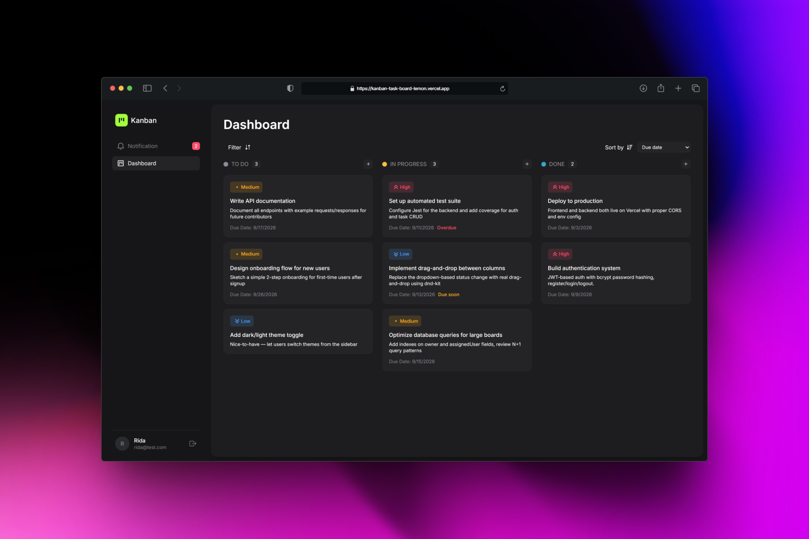
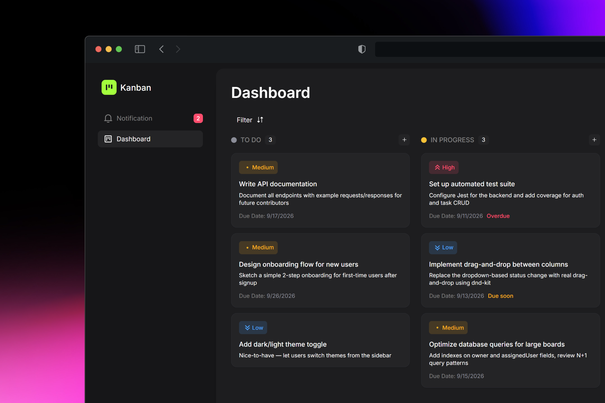

# Kanban Task Board

A full-stack, multi-user Kanban task management application with authentication, task assignment, real-time collaboration features (comments, activity history, notifications), and role-aware authorization throughout.

### **Live app:** https://kanban-task-board-lemon.vercel.app

### **API:** https://kanban-task-board-api-gilt.vercel.app




## Features

- **Authentication** — registration, login, logout with JWT-based sessions and bcrypt password hashing
- **Task management** — full CRUD, with title, description, status, priority, due date, and assignee
- **Kanban board** — three status columns (To Do / In Progress / Done), with per-column task creation
- **Assignment & collaboration** — tasks can be assigned to any registered user; both the creator and assignee can view, edit, and move a task, while deletion and reassignment remain owner-only
- **Filtering & search** — filter by priority, status, assignee, and free-text search across title/description, combinable and applied via query params
- **Sorting** — reorder tasks within columns by due date, priority, or recently updated
- **Due-date awareness** — visual indicators for overdue and due-soon tasks
- **Task detail view** — a slide-out panel with inline field editing, showing description, comments, and activity history in tabs
- **Comments** — threaded per-task comments, editable and deletable by their author only
- **Activity history** — an automatic audit trail of status, priority, due-date, and assignment changes per task
- **Notifications** — in-app notifications for assignment, status changes, comments, and task updates, with unread tracking and mark-as-read actions
- **Optimistic UI** — task field changes apply instantly on the board, with automatic rollback and error messaging if the underlying request fails
- **Responsive design** — a fully adapted mobile layout (collapsible sidebar, stacked board, full-width detail panel) alongside the desktop experience

## Tech Stack

**Frontend:** React (TypeScript), Vite, Tailwind CSS, React Router

**Backend:** Node.js, Express, MongoDB with Mongoose

**Auth:** JSON Web Tokens (JWT), bcrypt password hashing

**Deployment:** Vercel (frontend and backend as separate projects), MongoDB Atlas

## Architecture

The project is a monorepo with two independently deployed applications:

```
kanban-task-board/
├── client/
│   ├── src/
│   │   ├── api/
│   │   ├── components/
│   │   │   └── TaskDetailPanel/
│   │   ├── context/
│   │   ├── App.tsx
│   │   ├── index.css
│   │   ├── main.tsx
│   │   └── pages/
│   │       ├── LoginPage
│   │       ├── RegisterPage
│   │       └── BoardPage
│   │
│   ├── types.ts
│   ├── index.html
│   ├── vercel.json
│
└── server/
    ├── config/
    ├── models/
    ├── controllers/
    ├── routes/
    └── middleware/
    └── utils/
    └── server.js
```

The frontend and backend communicate entirely over a REST API secured with JWT bearer tokens; there is no server-side session state.

## Database Models

**User**
| Field | Type | Notes |
|---|---|---|
| name | String | required |
| email | String | required, unique, lowercase |
| password | String | required, bcrypt-hashed, never returned in API responses |
| createdAt / updatedAt | Date | automatic |

**Task**
| Field | Type | Notes |
|---|---|---|
| title | String | required |
| description | String | optional |
| status | String | enum: `todo`, `in-progress`, `done`; defaults to `todo` |
| priority | String | enum: `low`, `medium`, `high`; defaults to `medium` |
| dueDate | Date | optional |
| owner | ObjectId → User | required; the task's creator |
| assignedUser | ObjectId → User | optional |
| createdAt / updatedAt | Date | automatic |

**Comment**
| Field | Type | Notes |
|---|---|---|
| task | ObjectId → Task | required |
| author | ObjectId → User | required |
| content | String | required |
| createdAt / updatedAt | Date | automatic |

**Activity**
| Field | Type | Notes |
|---|---|---|
| task | ObjectId → Task | required |
| user | ObjectId → User | who performed the action |
| action | String | enum: `created`, `assigned`, `status_changed`, `priority_changed`, `due_date_changed`, `updated`, `comment_added`, `deleted` |
| previousValue / newValue | String | human-readable, when applicable |
| createdAt | Date | automatic |

**Notification**
| Field | Type | Notes |
|---|---|---|
| recipient | ObjectId → User | required |
| type | String | enum: `assigned`, `status_changed`, `comment_added`, `task_updated` |
| task | ObjectId → Task | required |
| message | String | pre-built, human-readable |
| read | Boolean | defaults to `false` |
| createdAt | Date | automatic |

## Authentication Flow

1. A user registers or logs in via `/api/auth/register` or `/api/auth/login`.
2. On success, the server returns a signed JWT (7-day expiry) alongside the user's public profile (id, name, email — never the password hash).
3. The frontend stores the token and user object (via React Context, persisted to `localStorage` so sessions survive a page refresh).
4. Every subsequent request to a protected endpoint includes the token as `Authorization: Bearer <token>`.
5. A `protect` middleware verifies the token on the server, attaches the authenticated user to `req.user`, and rejects invalid or missing tokens with `401`.
6. Logout is a client-side action (clearing the stored token) — the API itself is stateless, so there is no server-side session to invalidate.

Frontend routes are similarly protected: a `ProtectedRoute` wrapper redirects unauthenticated visitors to `/login`, and a `vercel.json` rewrite ensures direct navigation to any client-side route (e.g. a bookmarked `/login` or a page refresh) resolves correctly rather than 404ing.

## Authorization Rules

| Action                                                       | Who can perform it                    |
| ------------------------------------------------------------ | ------------------------------------- |
| View a task                                                  | Owner or assignee                     |
| Edit a task's title, description, status, priority, due date | Owner or assignee                     |
| Reassign a task to a different user                          | **Owner only**                        |
| Delete a task                                                | **Owner only**                        |
| View/add comments on a task                                  | Owner or assignee                     |
| Edit/delete a comment                                        | **The comment's author only**         |
| View a task's activity history                               | Owner or assignee                     |
| Mark a notification as read                                  | **The notification's recipient only** |

These rules are enforced at the API layer on every relevant endpoint — not just reflected in the UI — so a user cannot bypass them by calling the API directly.

## API Endpoints

**Auth**

- `POST /api/auth/register` — create an account
- `POST /api/auth/login` — authenticate, receive a token
- `POST /api/auth/logout` — client-side no-op (stateless JWT)

**Users**

- `GET /api/users` — list all registered users (for assignee selection)

**Tasks**

- `GET /api/tasks` — list the authenticated user's tasks (owned or assigned); supports `?priority=&status=&assignedTo=&search=` query params
- `POST /api/tasks` — create a task
- `GET /api/tasks/:id` — fetch one task
- `PUT /api/tasks/:id` — update a task
- `DELETE /api/tasks/:id` — delete a task

**Comments**

- `GET /api/tasks/:id/comments` — list a task's comments, chronological
- `POST /api/tasks/:id/comments` — add a comment
- `PUT /api/comments/:id` — edit a comment
- `DELETE /api/comments/:id` — delete a comment

**Activity**

- `GET /api/tasks/:id/activity` — list a task's activity history, newest first

**Notifications**

- `GET /api/notifications` — list the authenticated user's notifications
- `PUT /api/notifications/:id/read` — mark one notification as read
- `PUT /api/notifications/read-all` — mark all unread notifications as read

All endpoints except registration and login require a valid bearer token. Errors are returned with appropriate HTTP status codes (400 for invalid input, 401 for missing/invalid auth, 403 for authorization failures, 404 for missing resources, 500 for unexpected server errors) via a centralized **error-handling middleware**, and never expose raw internal error details to the client.

## Filtering & Sorting Behavior

- Filters (priority, status, assignee, search) are applied server-side via query parameters and combine with AND logic.

- Search matches against both title and description, case-insensitively.

- Sorting (due date, priority, recently updated) is applied client-side within each column after fetching.

- Filters and sort selection persist across task edits, since they're independent of the edit flow.

## Comment, Activity & Notification Systems

- **Comments** are scoped to a single task and support full CRUD; only a comment's author can edit or delete it, though anyone with access to the task can read and add comments.

- **Activity** is generated automatically — no user-facing controls exist to create or edit activity entries directly. Every meaningful task change (creation, status/priority/due-date/assignment changes, deletion) and every new comment produces an entry, shown newest-first in the task detail view.

- **Notifications** are generated automatically for the party who didn't make a change: assigning a task notifies the new assignee, a status or field change notifies whichever of the owner/assignee didn't make it, and a new comment notifies the other party. Notifications are surfaced via a bell icon with an unread-count badge, with individual and bulk mark-as-read actions.

## Local Setup

**Prerequisites:** Node.js, a MongoDB connection string

**Backend**

```bash
cd server
npm install
cp .env.example .env   # fill in your own values
npm run dev
```

**Frontend**

```bash
cd client
npm install
cp .env.example .env   # fill in your own values
npm run dev
```

## Environment Variables

**server/.env**

```
PORT=5000
MONGO_URI=your_mongodb_connection_string
JWT_SECRET=your_jwt_secret
VITE_API_URL=http://localhost:5000
```

**client/.env**

```
VITE_API_URL=http://localhost:5000
```

For a production build, `VITE_API_URL` should point to the deployed backend URL rather than localhost.

## Deployment

Both the frontend and backend are deployed as separate Vercel projects.

- The frontend's `vercel.json` includes a SPA rewrite (`/(.*) → /index.html`) so client-side routes resolve correctly on direct navigation or refresh.

- The backend's CORS configuration is scoped to the deployed frontend's origin (plus localhost for development), rather than allowing all origins.

## Known Limitations

- **No automated test suite:** Testing throughout the project was done manually and iteratively (via Thunder Client for the API, and manual verification for the UI) rather than with an automated framework.

- **Global user assignment, not team-scoped:** Any registered user can currently be assigned to any task — there's no concept of a "board" or "team" membership boundary limiting who's assignable. Real board/team membership is a planned future enhancement.

- **No drag-and-drop:** Status changes are handled through the task detail view's status control with optimistic UI updates, rather than drag-and-drop between columns. Drag-and-drop is planned as a future enhancement.
